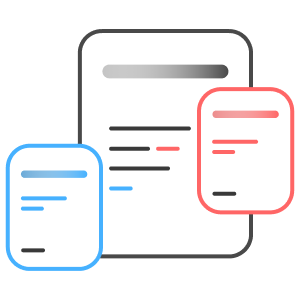

# gatsby-theme-andy

 

This is inspired by the work of [Andy](https://notes.andymatuschak.org/About_these_notes) and is based on [gatsby-theme-brain](https://github.com/aengusmcmillin/gatsby-theme-brain).

Demo - [https://notes.aravindballa.com](https://notes.aravindballa.com/)

## Usage

- Create a new Gatsby project
- `yarn add gatsby-theme-andy`
- Add `gatsby-theme-andy` to plugins in `gatsby-config.js`
- Create directory `content` at root and add `md` files.
- `gatsby develop`

## Configuration

All the plugin options valid for [gatsby-theme-brain](https://github.com/aengusmcmillin/gatsby-theme-brain) can be given to this theme as well.

You can shadow/overrride few componenets in your project. In your directory, you would need to place them at `./gatsby-theme-andy/src/components`. Have a look at the default components to see what `props` they get. Components you can override -

- [Popover.js](https://github.com/aravindballa/gatsby-theme-andy/blob/master/src/components/Popover.js) - This is the component which is shown when you hover over an internal link.
- [RefferedBlock.js](https://github.com/aravindballa/gatsby-theme-andy/blob/master/src/components/ReferredBlock.js) - The block which contains all the references to the note. This is at the bottom of the page
- [BrainNote.js](https://github.com/aravindballa/gatsby-theme-andy/blob/master/src/components/BrainNote.js) - This is the general layout of the page.

## Contribution

This project is relatively new. Please report issues you face and make PRs by forking the project.
